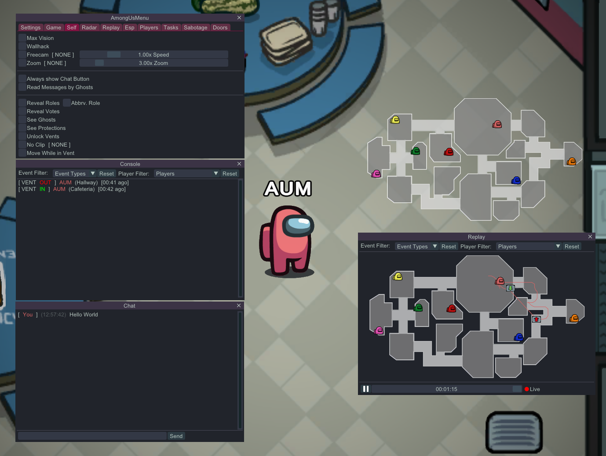

## This patch tries to fix issues related to the Fungle update. If all goes well, v1.0 will be fully released!
## Version 1.0 will be fully released with the new release. The latest source code will be moved to a separate repository for issue support.

# Original AmongUsMenu (BitCrackers)  
Note: I am not part of the BitCrackers team, these links are for BitCrackers only.

   SickoModeAU is a Cheat Menu forked from AmongUsMenu for the popular Game Among Us.

## Disclaimer
This project is for Educational Use only. We do not condone this software being used to gain an advantage against other people. This project is aimed to make Innersloth's anticheat better.

## Compile (Configurations)
You can compile two different versions of the menu. Normal or Version Proxy. Steps to compile can be found here: https://docs.google.com/document/d/16Tnqk7LIqyQlw74TuV34Wsy9JDqIfVy7DgUndwIL3uw/edit?usp=sharing

### Normal (SickoModeAU.dll)
Inject it with any injector you have.

- Debug (With Debug Information and can be attached to process)
- Release (Optimized with all information stripped)

### Version Proxy (version.dll)
Will automatically be loaded by the Game itself if the dll is in the game directory.

- Debug_Version (With Debug Information and can be attached to process)
- Release_Version (Optimized with all information stripped)

### Running on Proton (Version Proxy Only)
First you will need protontricks, you can install it with your packager of choice.

1. Make sure you are running Among Us under Proton  
   You can check by going to **Properties -> Compatibility**
3. Put version.dll into Among Us folder
4. Run `protontricks --gui`
5. Choose **Among Us**
6. Click on **Select the default wineprefix** and then **OK**
7. Click on **Run winecfg** and then **OK**
8. In the configuration window, click on **Libraries**
9. Type `version` into the **New override for library** input
10. Click **Add** and then **Apply**
11. SickoModeAU should now work properly in the game

### Default Hotkeys
- Show Menu - DELETE
- Show Radar - INSERT
- Show Console - HOME
- Show Replay - END
- Repair Sabotage - PAGE DOWN (PgDn)

## Screenshot

   

## Special Thanks
* The BitCrackers team for creating a great mod, which was easy to add features to
* [KulaGGin](https://github.com/KulaGGin) (Helped with some ImGui code for replay system)
* [tomsa000](https://github.com/tomsa000) (Helped with fixing memory leaks and smart pointers)
* Everyone else who contributed to the code and I couldn't list here. Thank you!

## Contributing

1. Fork it (<https://github.com/BitCrackers/AmongUsMenu/fork>)
2. Create your feature branch (`git checkout -b feature/fooBar`)
3. Commit your changes (`git commit -am 'Add some fooBar'`)
4. Push to the branch (`git push origin feature/fooBar`)
5. Create a new Pull Request

## Broken Features (as of now)
Exiting vent does not show up on replay (can be fixed by properly hooking Vent_ExitVent)
Random crashes in the middle of nowhere (can be fixed by properly updating il2cpp_types.h)

## Added/Changed Features
Settings Tab:
1. Hide Keybinds (so u don't accidentally change any keybind when opening menu)
2. Menu Size (More control over size with slider)
3. Colored / RGB menu theme (more customization - also applies to radar/replay)
4. Automatically set name / Set name button (more control over ign)
5. Custom Streamer Mode lobby code (changes ****** to custom text - defaults to GOATYY)
6. Level Spoofer (changes ur pointless amogus level to a cool number)
7. Cosmetic Unlocker (added toggle for when u wanna unlock stuff legit)
8. Safe Mode (when toggled off, adds more features that were originally detected by anticheat - meant to be used in servers w/ no anticheat)

Game Tab:
1. No Ability Cooldown (removes cooldown for venting/vitals/killing/shapeshifting (in certain cases)/protecting)
2. Fortegreen in the list of available colors (accessible w/ host)
3. Color Sniper (when a player with ur color leaves, change to that color immediately)
4. Chat message sending (add newlines and stuff, spam when not in safe mode)
5. Cycler (change ur cosmetics/name randomly)
6. Confuser (randomize appearance at will to avoid being detected)
7. Revive (only as host, self-explanatory)
8. Spam Report (keeps on reporting dead bodies even while in a meeting)
9. Disable Game Ending (only as host)
10. End Game (host only, select a reason and end the game at ur own will)
11. Force name/color for everyone (host only)
12. Added hide and seek game options

Self Tab:
1. Disable HUD (self-explanatory)
2. Freecam/Zoom (now works in the lobby, ik it's pointless)
3. Custom Name (adds a custom client-sided (server sided option when hosting) name with color and formatting)
4. Show Player Info in Lobby (shows player level, friendcode)
5. Player Colored Names (self-explanatory)
6. Move in Vent (added moving while shapeshifting)
7. Always Move (move while chatting, meeting, etc.)
8. Kill Other Impostors (self-explanatory)
9. Right Click TP (changed so u have to hold shift)
10. Teleport/Rotate everyone (only when not in safe mode)
11. Coordinate-based Teleport (input x and y coordinates)
12. Move in Meeting (self-explanatory)
13. Fake Role (adds a client-sided role such as impostor)

Radar Tab / Radar:
1. Changed the crewmate icon
2. Added a border to the radar

Replay Tab:
None

ESP Tab:
1. ESP now works in lobby

Players Tab:
1. Show Extra Info (player id, friendcode, level, user id)
2. Allows calling a meeting while already in a meeting
3. Force call a meeting by another player (host-only)
4. Allows killing even with non killer role (sometimes doesn't work due to limitations)
5. Murder Loop (kills the player 20 times, useful when the person keeps annoying you)
6. Suicide / Suicide Loop (makes the player unalive themselves (in the game ofc))
7. Kill All Crewmates/Impostors (self-explanatory)
8. Vote Controls (host-only)
9. Kick/Ban (host-only)
10. Shapeshift into selected player (self-explanatory, also adds an option to shapeshift everyone to player when not in safe mode)
Note: The cooldown is not set, meaning you will get kicked for shifting during the cooldown
11. Protect selected player (self-explanatory)
12. Teleport player to you (self-explanatory)
13. Attach to player (constantly teleports you to a player)
14. Set roles for player (doesn't work after game starts)
15. Revive player (self-explanatory)
16. Set Scanner (only when not in safe mode)
17. Force name/color (host-only)
18. Chat spoofing (only when not in safe mode)

Tasks Tab:
1. Keybind for complete all tasks
2. Complete Everyone's Tasks (only when not in safe mode)
3. Complete Tasks even as Impostor (doesn't do anything other than show u have completed tasks to urself and other cheaters)
4. Warning when visual tasks are turned off
5. Changed weapons button to a checkbox (constantly plays weapons animation when toggled)
6. % tasks completed by all crewmates

Sabotage Tab:
1. Map specific names for reactor sabotage

Doors Tab:
None

Debug Tab:
1. Clear RPC Queues (when too many packets are in queue to send to server)

Miscellaneous:
1. Allow all characters in chat and extend char limit (in special cases)
2. Kill packets changed from CmdCheckMurder to RpcMurderPlayer (allows killing in certain cases)
3. Added mod version and shows when freecam/noclip is turned on
4. Disable freecam moving when chat text is focused

## Removed Features
1. Removed custom RPC and AUM chat (prevents detection by other mod users)

## Notes
1. If you get crashes, make sure you upload your "smau-log.txt" (in your Among Us directory) and mark the issue on the repo.
2. If your game crashes when joining a lobby, host a local lobby then join that lobby.
